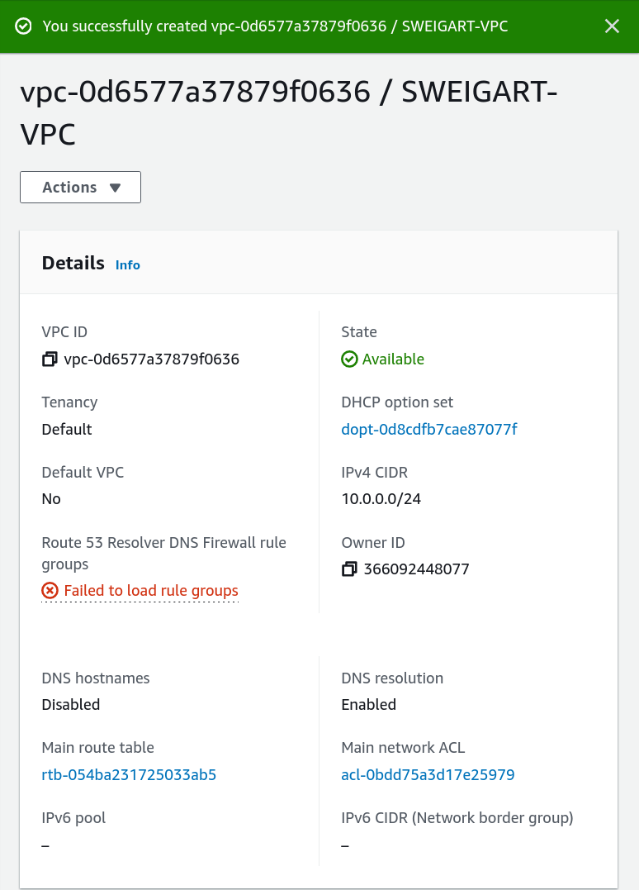
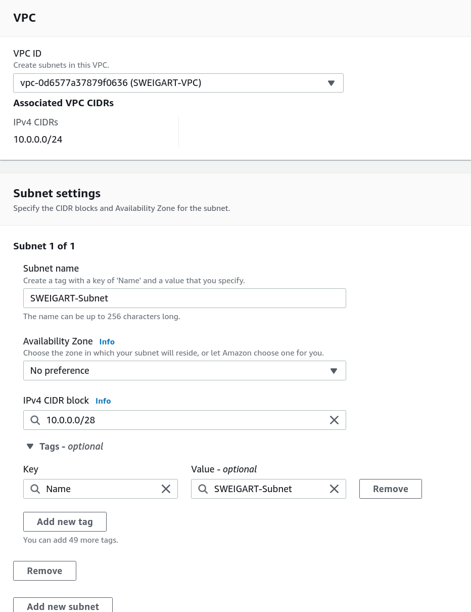
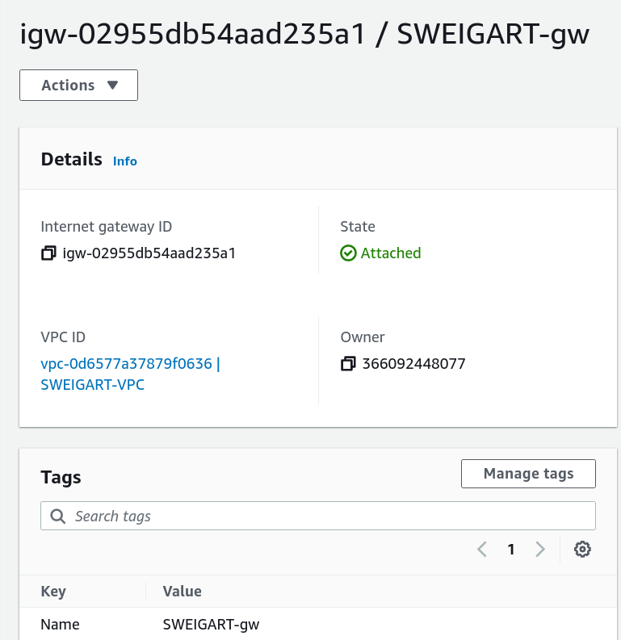
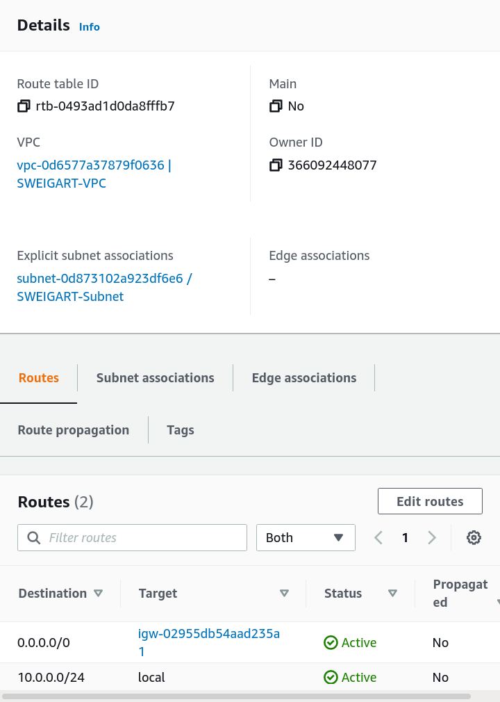
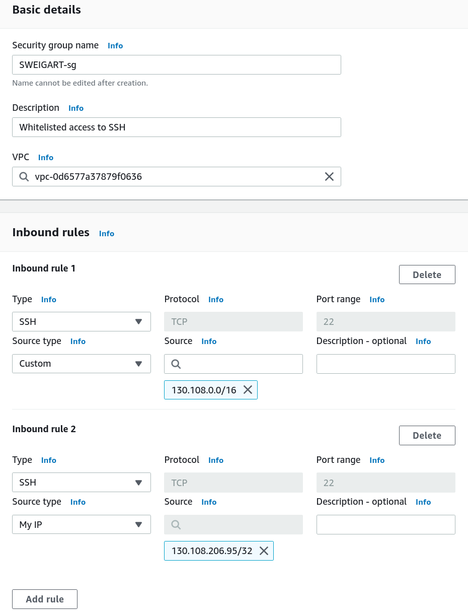
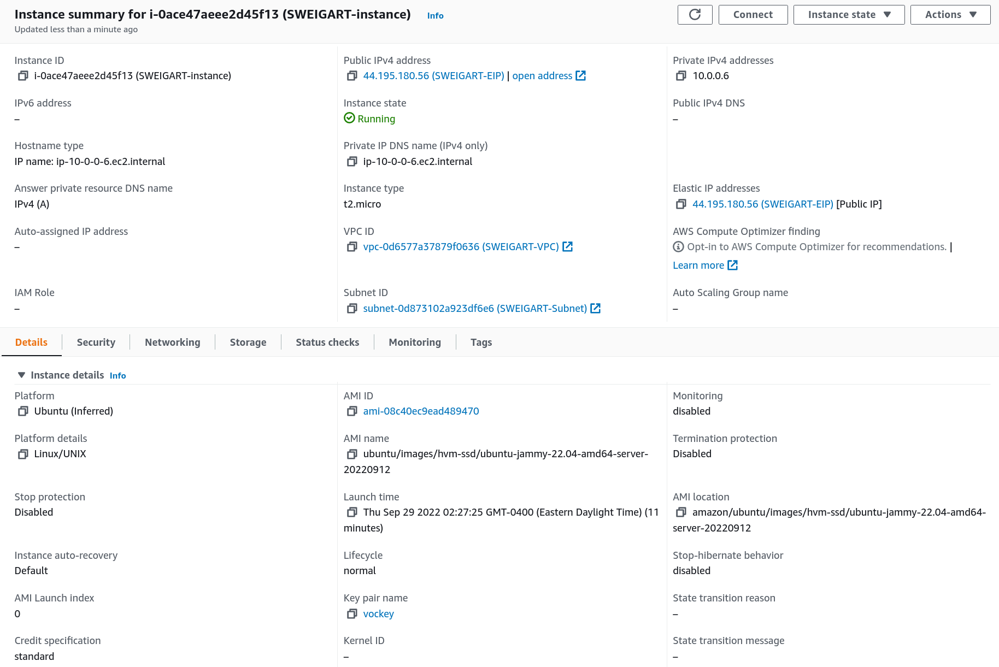
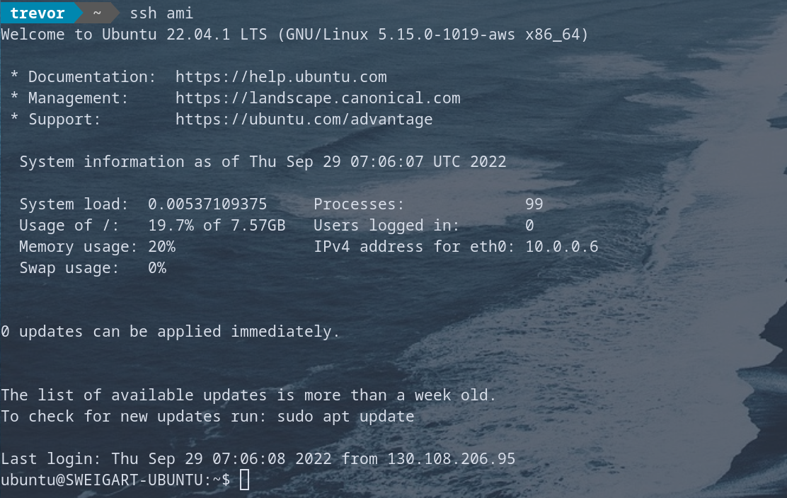

# Part 1

All images in *images* folder

1. VPC:
  - A VPC is a private seperate private network that is only visible within the same network unless given other rules.
  - 

2. Subnet:
  - A subnet defines a range of IP addresses
  - 

3. Internet Gateway:
  - An internet gateway sits between the host and client network to route traffic to appropriate places
  - 

4. Routetable:
  - A routetable is a set of rules that tells the gateway where to route traffic
  - 

5. Security Group:
  - A security group controls what traffic is allowed to be outbound and inbound
  - 

# Part 2

1. AMI Instance: Ubuntu
  1. Default username: ubuntu
  2. Instance type selected: t2.micro
    - More resources are not needed for this purpose

2. Attaching instance to VPC:
  - In the instance creation options: Network Settings > Edit > VPC > SWEIGART-VPC

3. I left the default setting of "Disabled" for auto assigning an IPv4 address since an elastic ip will be assigned anyway, which should avoid any conflict and extra steps with unassigning the initial public ip

4. Elastic block store > Volumes > Select volume > attach > SWEIGART-VPC

5. Instance creation options: Name and tags > Value: SWEIGART-instance

6. Instance creation options: Network Settings > Common Security Groups > SWEIGART-sg

7. Network and Security > Elastic IP's > Allocate Elastic IP Address > Amazon's pool of IPv4 Addresses > Name: SWEIGART-EIP

8. 

9. ssh -i .ssh/labsuser.pem ubuntu@44.195.180.56
  - sudo vim /etc/hostname > SWEIGART-UBUNTU
  - sudo vim /etc/hosts > localhost SWEIGART-UBUNTU
  - Reboot the instance

10. 
